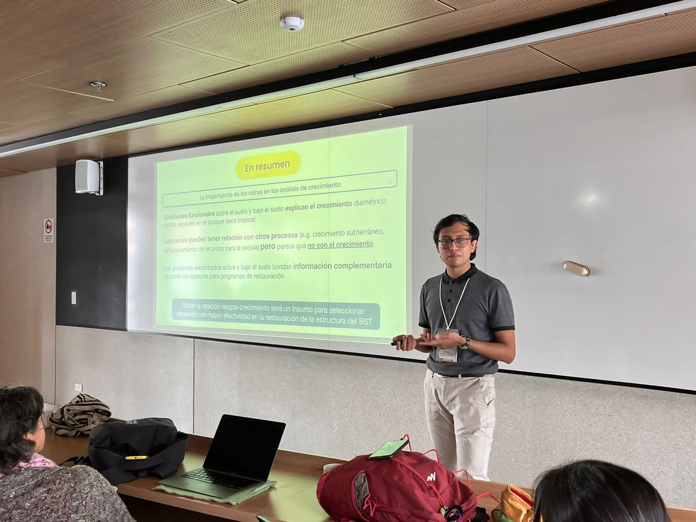
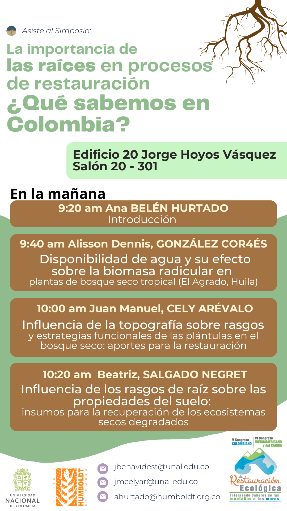
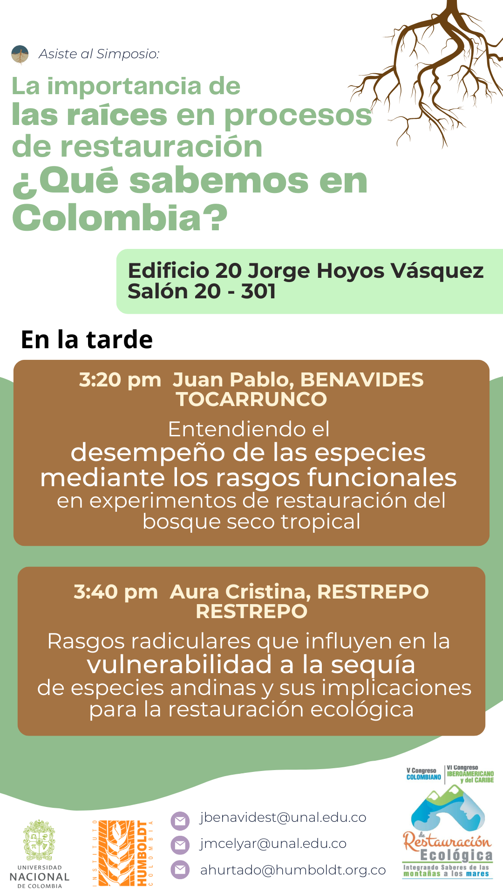

# Simposio de conocimiento de raíces finas en Colombia - Reflexiones finales

{fig-alt="Juan presentando sobre rasgos y su relacion con el crecimiento"}

El comité organizador del simposio: Juan Manuel Cely, Ana Belén Hurtado y yo, resume los principales puntos socializados en el simposio:

En el simposio de raíces se presentaron las siguientes charlas donde se hablaron de los siguientes temas principales:

1.  Ana Belén Hurtado - la importancia de estudiar raíces y su relación con la restauración

2.  Alisson González - las raíces en las plántulas de bosque seco en el vivero y sequía

3.  Juan Manuel Cely - las raíces en las plántulas en el bosque seco y topografía

4.  Beatriz Salgado Negret - las raíces y su efecto en el suelo en el bosque seco

5.  Juan Pablo Benavides - las raíces y su relación con el crecimiento en el bosque seco

6.  Estela Quintero - las raíces en el bosque andino y sequía

A partir de los novedosos estudios presentados y las enriquecedoras preguntas y comentarios generados en los espacios de discusión, se generaron las siguientes conclusiones:

-   El estudio de las raíces se presenta como una innovación y se destaca por estar en la frontera del conocimiento.
-   Las metodologías de muestreo, rasgos a medir y análisis en las raíces deben tener puntos comunes que permitan su comparación a través de los estudios.
-   El estudio de las raíces se ha realizado mayoritariamente en el bosque seco, solo un trabajo se realizó en el bosque andino. No hubo representación de otros ecosistemas.
-   Entender los microorganismos que interactúan con las raíces es importante, se debe explorar más en la relación con endófitos y micorrizas.
-   Los trade-off de los órganos encima y debajo del suelo son igual de clave para entender el funcionamiento de las plantas y se complementan mutuamente.
-   Surge la necesidad de entender el papel que cumplen las condiciones edáficas sobre los cambios y tendencias que observamos en las raíces.
-   La información que brindan las raíces es fundamental para entender los procesos de restauración ecológica tanto para la propagación en el vivero, la implementación y siembra en campo, así como el monitoreo de las propiedades del ecosistema y de la efectividad de las especies en terrenos degradados.

{fig-alt="Agenda del simposio"}

