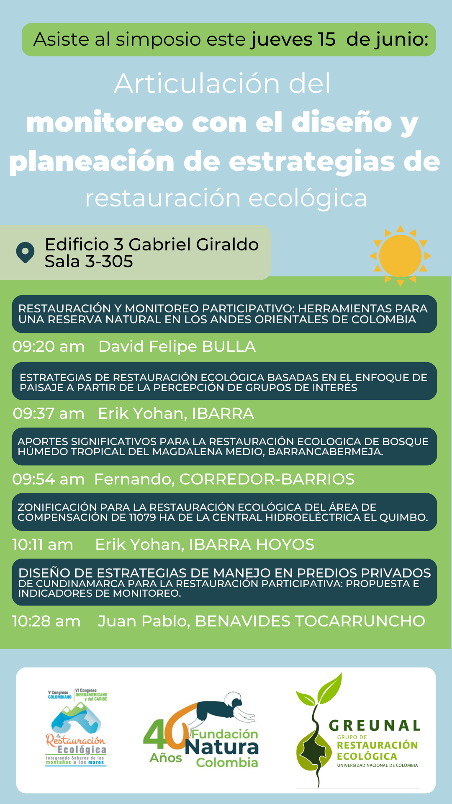
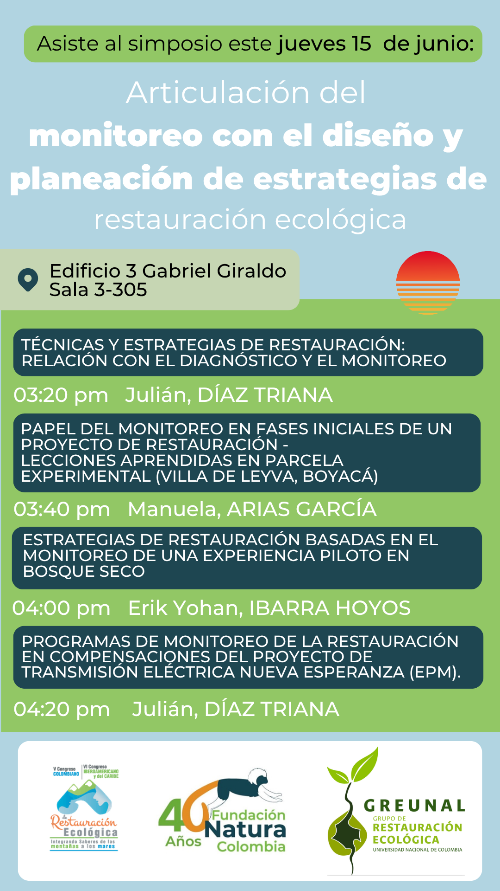

Fue un plazer haber participado en la organización de este simposio donde presentamos el trabajo realizado por el grupo de restauración (Greunal) durante los años 2021 y 2022 que dió como resultado dos cartillas de talleres de divulgación sobre la restauración ecológica en ecosistemas andinos.

Puedes encontrar las publicaciones divulgadas en los siguientes link

[Cápsulas de Restauración Ecológica - Experiencias Locales en Cundinamarca y Boyacá](https://www.researchgate.net/publication/377845778_Capsulas_de_Restauracion_Ecologica_-_Experiencias_Locales_en_Cundinamarca_y_Boyaca?utm_source=twitter&rgutm_meta1=eHNsLXhJNFBPRUsrZ3VTY0NCc2xxM3QxRm5vNU4wazVLQzh5dHY2bVZQQi94VWFaeTVGYy9PbERsOWpaelNiYjVIVUxrTWppdWs2eFhUeTBuUjJIaVNSSm1LRT0%3D) 2023

[Cápsulas de Restauración Ecológica - El cerro San Marcos (Villa de Leyva, Boyacá, Colombia)](https://www.researchgate.net/publication/369268111_Capsulas_de_Restauracion_Ecologica_-_El_cerro_San_Marcos_Villa_de_Leyva_Boyaca_Colombia) 2021

{fig-align="center"}

{fig-align="center"}
